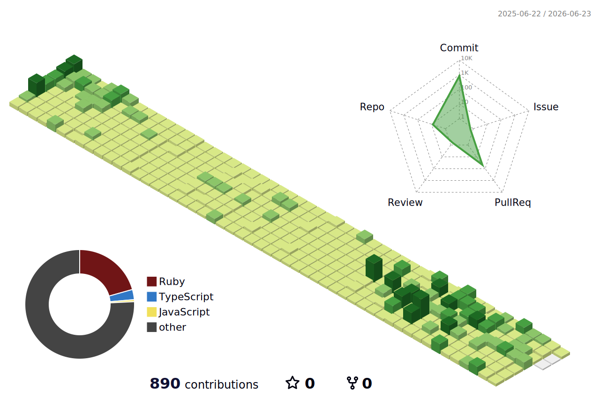

## 👨🏻‍🎓 自己紹介
社会人2年目の新米エンジニアです。  
React(Next.js), Railsを中心に学習しています。

## 💻技術スタック
### フロントエンド

### バックエンド・DB

### インフラ

### 開発環境など

## 📝 保有資格
+ ITパスポート
+ 基本情報技術者
+ Oracle Certified Java Programmer, Silver SE 11
+ AWS Certified Cloud Practitioner (CLF-C02)
+ AWS Certified Solution Architect Associate (SAA-C03)
+ Linux Professional Institute Certification Level 1
+ タイピング技能検定 ２級

## ✏️ 技術ブログ
- [【初学者向け】依存性の注入（DI）とは](https://qiita.com/river3570/items/7694c888cb5f2f7506dc)
- [N+1問題とは？RailsのActiveRecordで理解する原因と解決策](https://qiita.com/river3570/items/80386683d5d85c8ed98a)
- [意外と知らないHTTPステータスコード集HTTP](https://qiita.com/river3570/items/66c48af8529f861b6dd7)
- [常用AIをChatGPTからClaudeに変えてみた感想](https://qiita.com/river3570/items/82929a2befa2992ef5ad)
- [Reactのカスタムフックとは？](https://qiita.com/river3570/items/27147d7506fe5d3bbeb1)

## ⚖️ 学習履歴

## 🌱 コミット履歴

  
  
  
  
  

